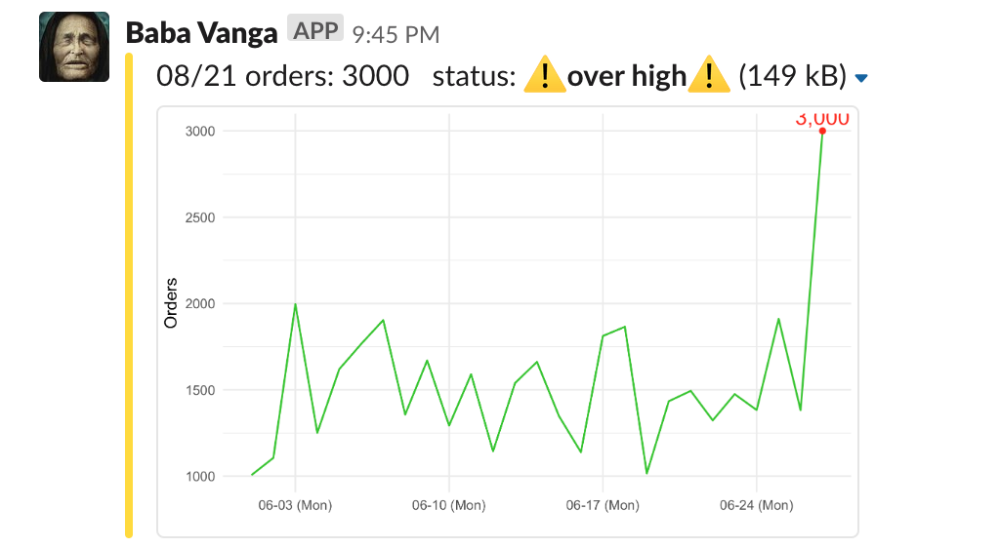

  
# Slackeonnier :dove: 
`Slackeonnier` - send data notifications with color and plot to Slack by :dove:.
  
## Features
#### :traffic_light: Color Management   
#### :bar_chart: Made For Data People
#### :beers: Simple Integrate within your Workflow

:no_bell: ~SHUT YOUR BOSS UP~ MUTE REDUNDENT QUESTIONS FROM YOUR BOSS
  
## Basic Idea
please check out [my article](https://medium.com/@henry48124/build-data-alert-notification-on-slack-for-your-start-up-37db460fe812).

## Installation
```R
# Depeche mode
devtools::install_github("HongYanHuang/slackeonnier")

# Classic - uploading
# install.packages("slackeonnier")
```

## Quick Start
### 1. Load library and setup
```R
# load library
library(slackeonnier)

## setup slackeonnier
slackeonnier_setup(upload_api_token = "your slack upload token",
                   upload_image_channel = "#your-storage-channel",
                   incoming_webhook_url = "your incoming webhook",
                   sent_channel = "#general",
                   username = " ")
```
### 2. Prepare your text, color
```R
## upload your plot, will return a private slack-url for attach
plot_url <- plot_upload(plot = your.plot)

## formating text, color, plot
atc <- attachment_format(former_text = your_text,
                  status_color = color_hex,
                  image_url = plot_url)
```
### 3. High five, bird fly, you smile!
```R
## sent by slackeonnier
slackeonnier_sent(atc)
```

or you can run [example script](./quick_start.R)