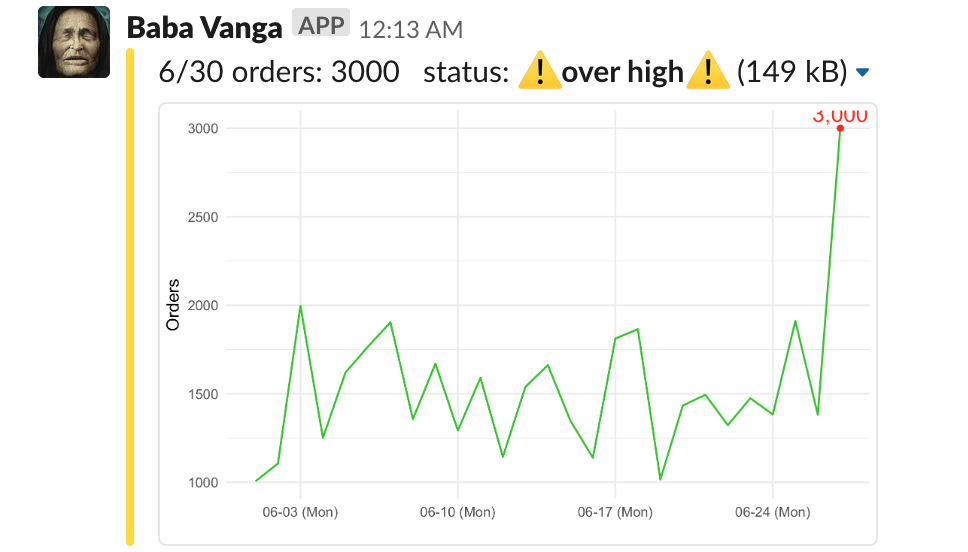

  
# Slackeonnier :dove: 
`Slackeonnier` - send data notifications with color and plot to Slack by :dove:.
  
## Features
#### :traffic_light: Customized Color Management
#### :bar_chart: Plot + Text + Color = DONE!

:no_bell: Mute redundent quetions from your boss
  
## Basic Idea
1. Upload plot to slack in alternative channel, return a private url for sharing on slack
2. Pack plot, text as an attachment with color
3. Send attachment to the channel you'd like to share

Complete ideation and implementation please check out [medium article](https://medium.com/@henry48124/build-data-alert-notification-on-slack-for-your-start-up-37db460fe812).

## Installation
```R
# Depeche mode
devtools::install_github("HongYanHuang/slackeonnier")

# Classic - coming soon
# install.packages("slackeonnier")
```

## Quick Start
### 1. Load library and setup
```R
# load library
library(slackeonnier)
```
```R
## setup slackeonnier
slackeonnier_setup(upload_api_token = "your slack upload token",
                   upload_image_channel = "#your-storage-channel",
                   incoming_webhook_url = "your incoming webhook",
                   sent_channel = "#general",
                   username = " ")
```
### 2. Plot + Text + Color = 
```R
## upload your plot, will return a private slack-url for attach
plot_url <- plot_upload(plot = your.plot)

## formating text, color, plot
atc <- attachment_format(former_text = your_text,
                  status_color = color_hex,
                  image_url = plot_url)
```
### 3. DONE :dove: 
```R
## sent by slackeonnier
slackeonnier_sent(atc)
```

or you can run [example script](./quick_start.R)
